# LegalEase – Online Lawyer Hiring Platform

**LegalEase** is a modern, responsive web application designed to connect users with verified legal professionals. Users can easily browse lawyers, search by name or specialization, and manage bookings, while legal professionals and admins have dedicated dashboards to handle their services and insights efficiently.

---

## Live Demo

- **Live Site:** [https://legalease-app.vercel.app](https://legalease-client-five.vercel.app)

---

## Key Features

-  **Multi-Role Authentication**: Secure authentication system supporting regular **Users**, **Lawyers**, and **Admins**.
-  **Lawyer Directory**: Easily browse and search legal experts by name or specialization using global search.
-  **Dynamic Role-Based Dashboards**:
  - **User Dashboard**: Manage appointments, consultations, and profile settings.
  - **Lawyer Dashboard**: Manage consultation requests, client schedules, and profile details.
  - **Admin Analytics Dashboard**: System-wide oversight, user management, and platform analytics.
-  **Fully Responsive UI**: Mobile-first design with an interactive navigation bar, drawer menu, and clean layout.
-  **Optimized Performance**: Built with Next.js App Router and dynamic Suspense boundaries for fast page loads and smooth client-side routing.

---
## User Interface Preview

### Landing Page
The homepage provides a modern legal marketplace experience with featured lawyers, quick search, and consultation options.

<p align="center">
  
</p>

### Browse Layers
Users can search, filter, and explore verified lawyers based on specialization and consultation fees.

<p align="center">
  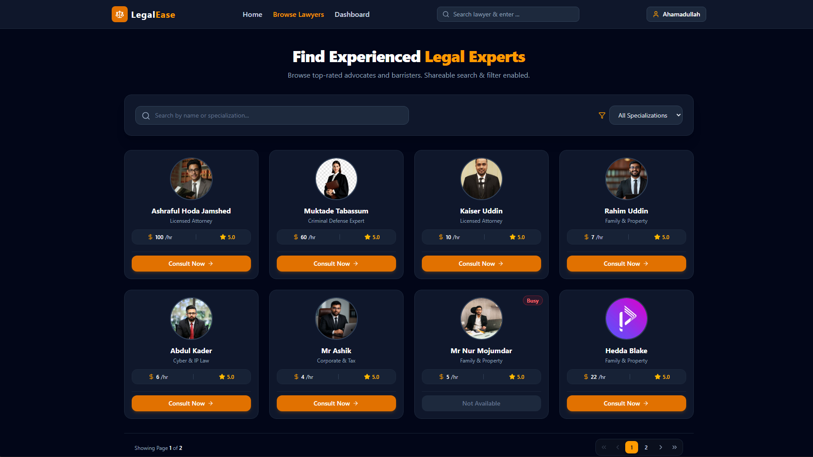
</p>

### Lawyer Profile Details
Detailed lawyer profiles showcase qualifications, experience, consultation fees, awards, and client feedback access.

<p align="center">
  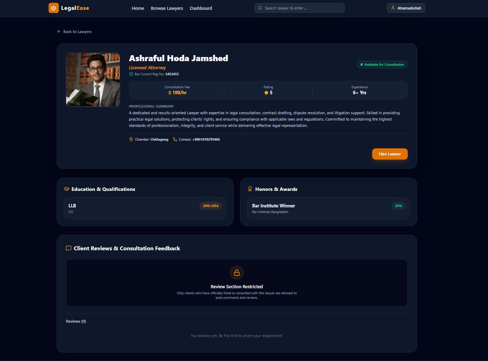
  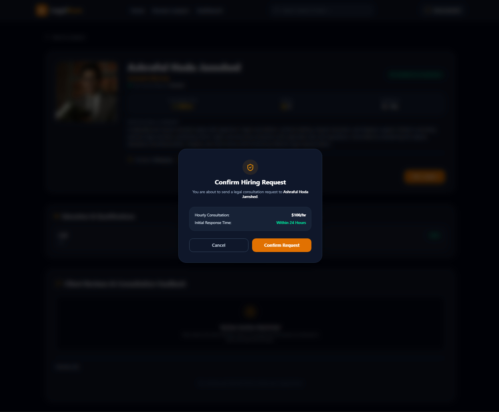
</p>

### Dashboard
#### User Dashboard

<p align="center">
  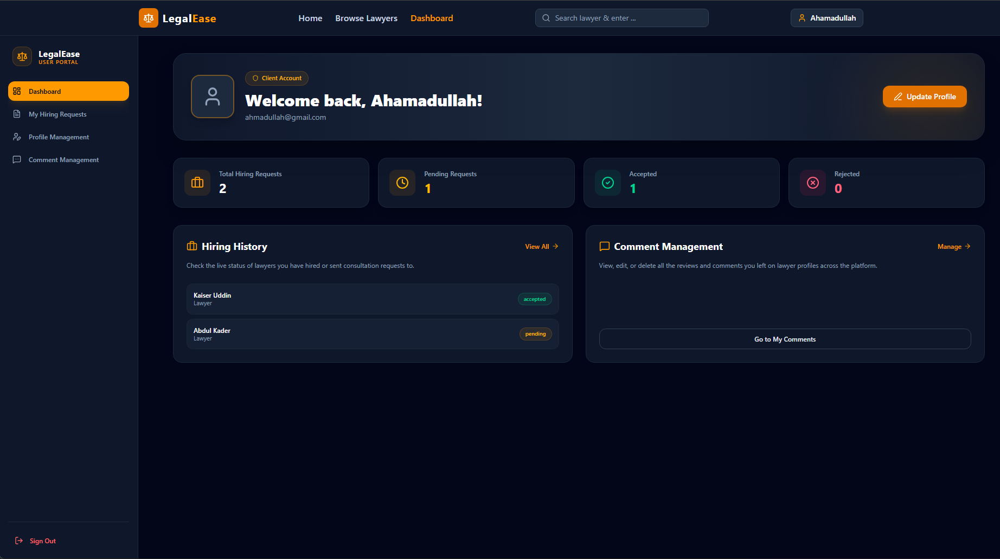
  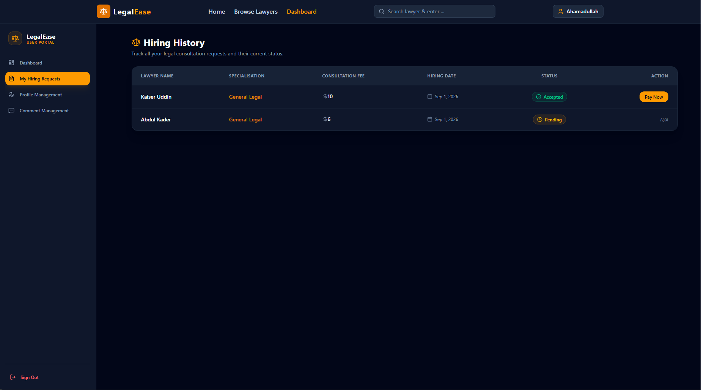
  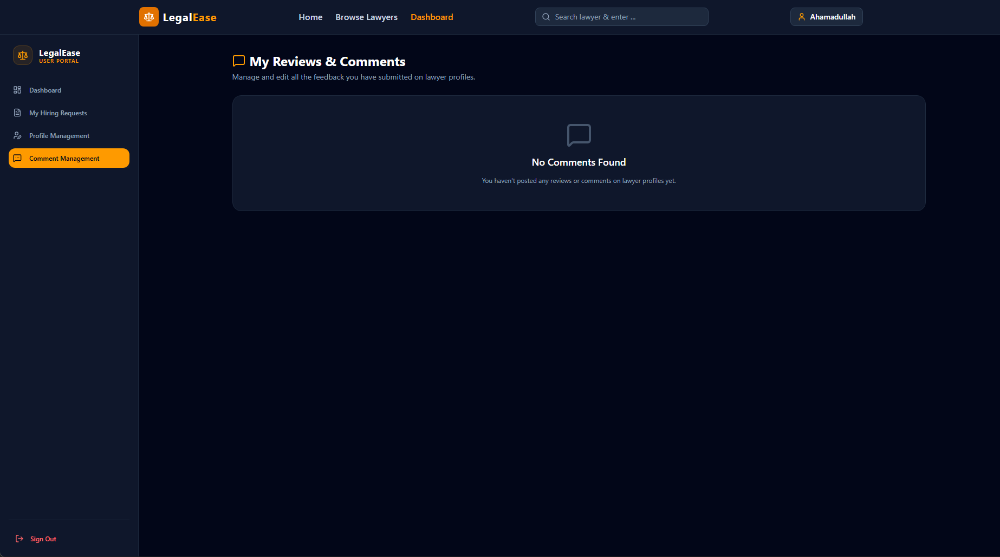
  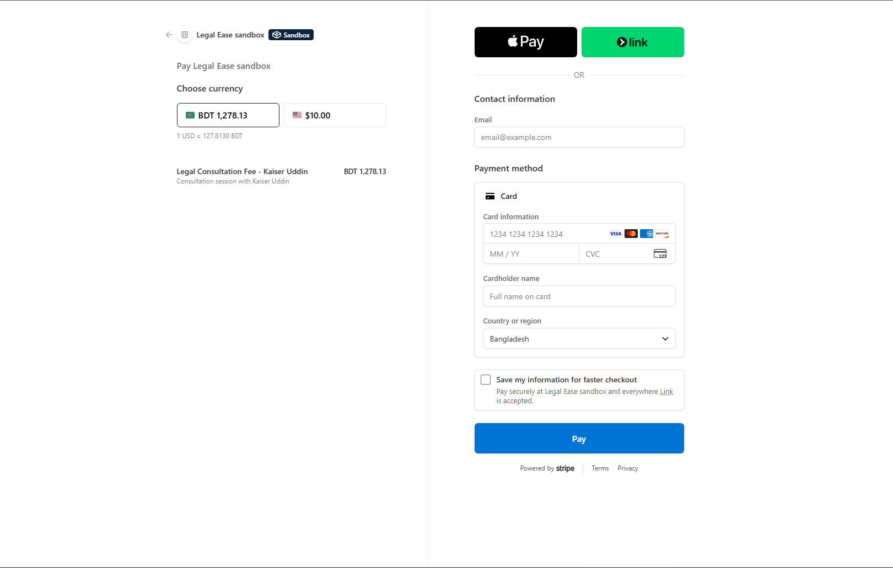
</p>

#### Lawyer Dashboard

<p align="center">
  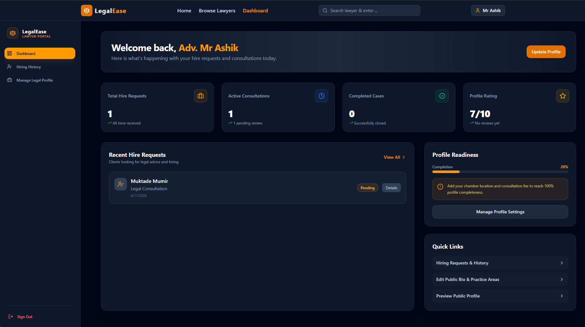
  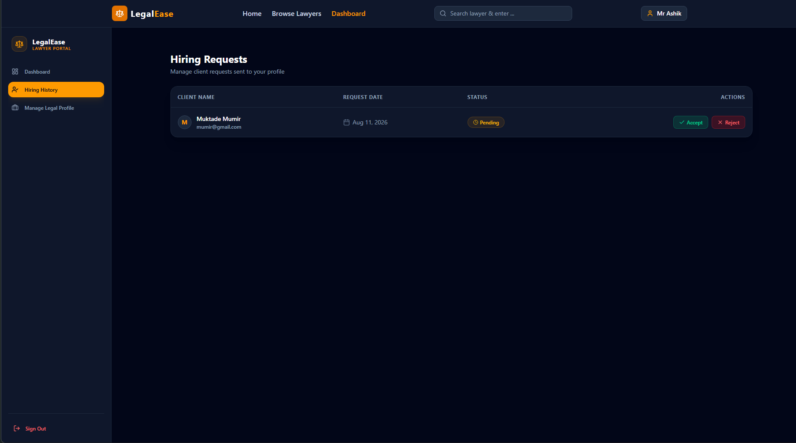
  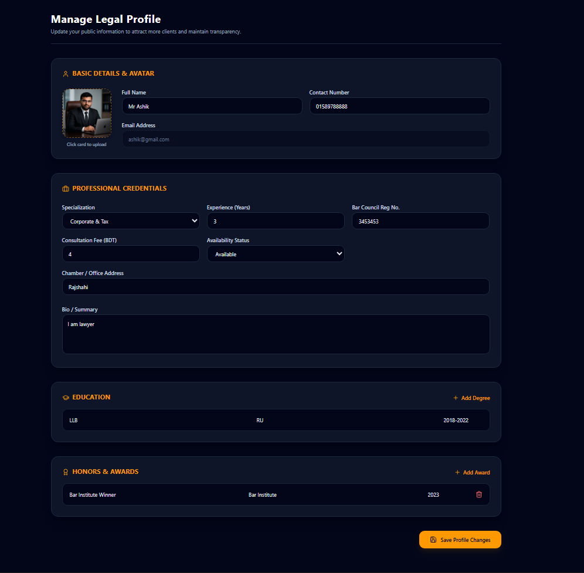
</p>

#### Admin Dashboard

<p align="center">
  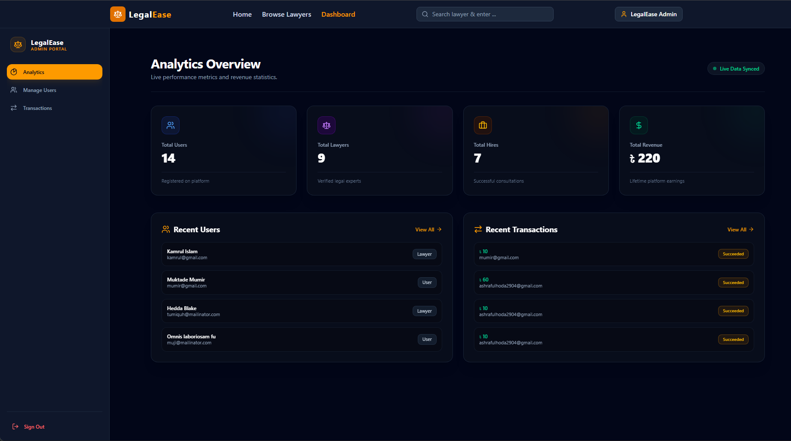
  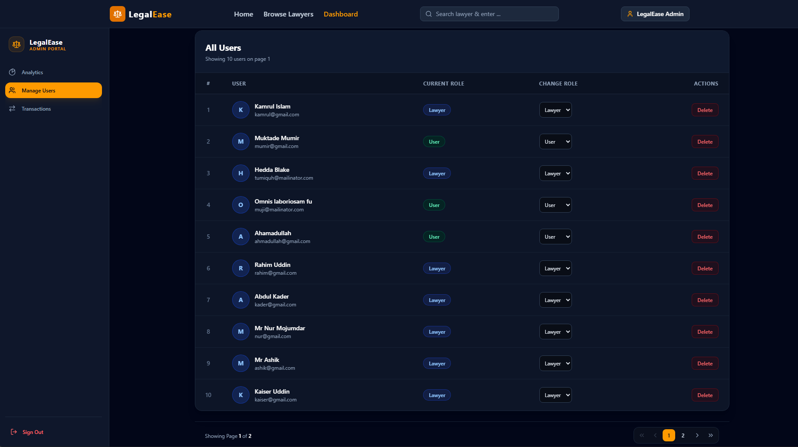
  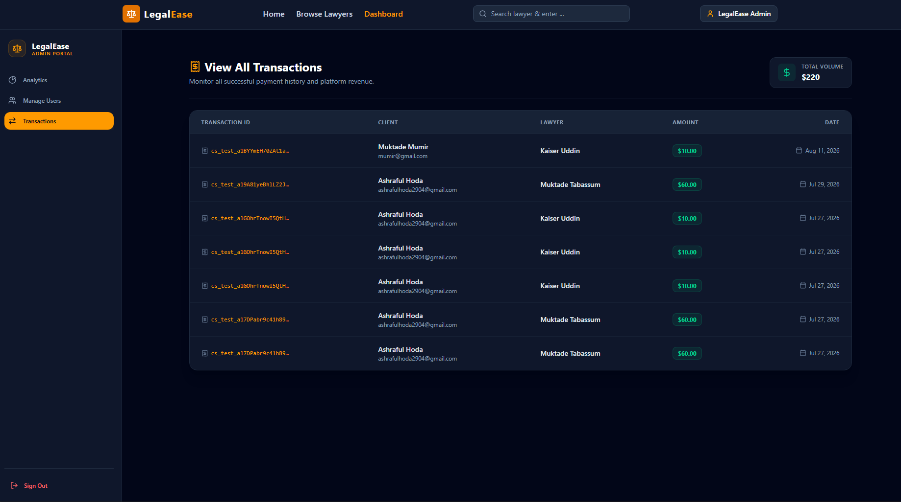
</p>


##  Tech Stack & NPM Packages Used

### **Framework & Core**
* **[Next.js](https://nextjs.org/)** (App Router) – React framework for Server-Side Rendering (SSR) & Static Site Generation (SSG).
* **[React](https://react.dev/)** – Frontend UI Library.

### **Authentication**
* **[Better Auth](https://www.better-auth.com/)** (`better-auth`) – Modern, lightweight authentication client and server utility.

### **Backend**
* **[Express.js](https://expressjs.com/)** – Fast, unopinionated, minimalist web framework for Node.js.
* **[MongoDB](https://www.mongodb.com/)** – NoSQL Database for fast and scalable data storage.

### **Styling & UI**
* **[Hero UI](https://www.heroui.com/)** (`@heroui/react`) – Beautiful, fast, and modern React UI library (formerly NextUI).
* **[Tailwind CSS](https://tailwindcss.com/)** – Utility-first CSS framework for rapid UI styling.
* **[Lucide React](https://lucide.dev/)** (`lucide-react`) – Clean and customizable icons for the layout.

---

## Packages Used
```
npm install better-auth @better-auth/mongo-adapter mongodb @heroui/react lucide-react react-icons
```
--- 

## Author
**Ashraful Hoda Jamshed**
